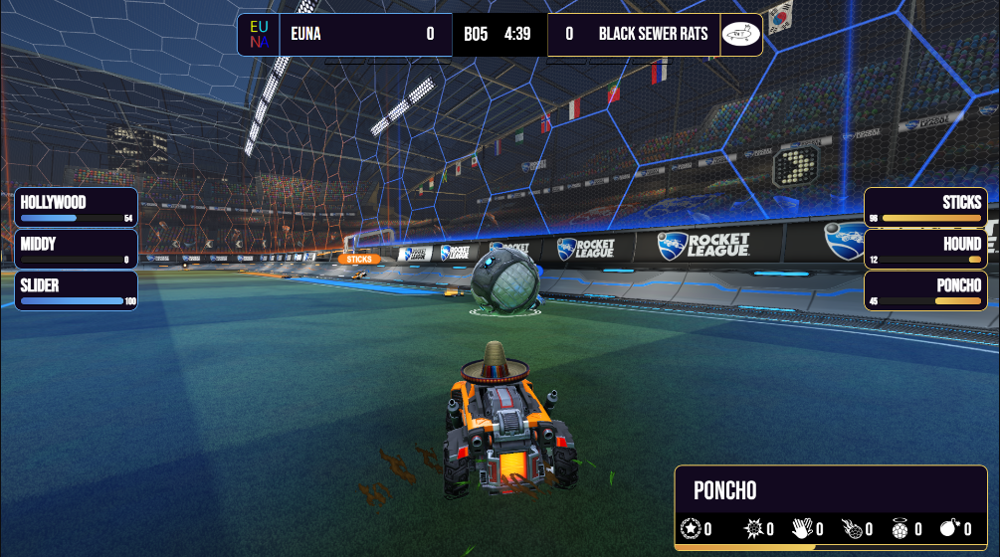
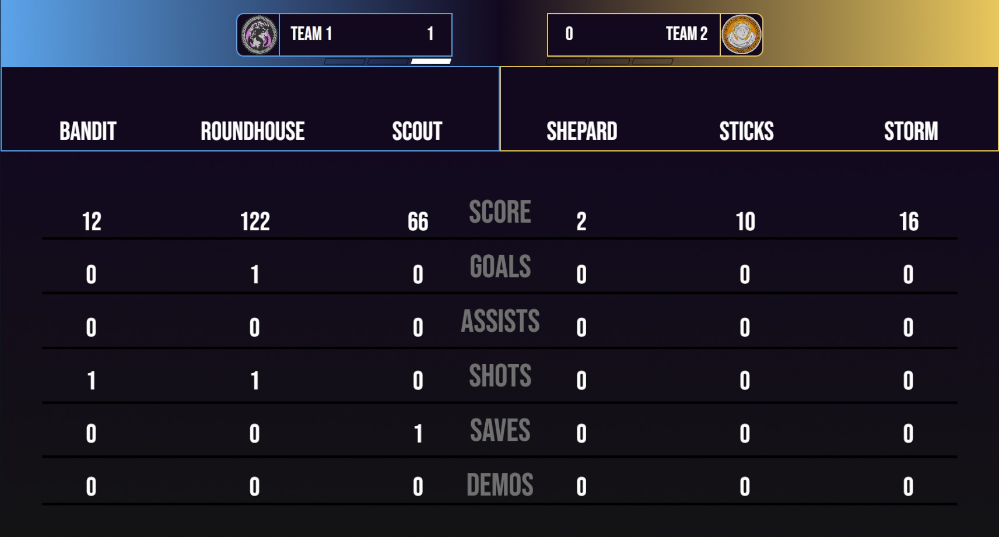

# SOSplugin
Rocket League Overlay

### It is an overlay for the video game Rocket League that uses a third party plugin to read real time data from the game so it can be manipulated and displayed.

#Files named Overlay_BO#_#s are the newest version of the overlay. Files named OverlayBO#NewCOlor#s is the older version

#### Tracks:
Player Score  
Player Goals  
Player Assists  
Player Shots  
Player Saves  
Player Demos  
Player Boost  

Team Score  
Time Left  
Series Score  
Player Names  
Team Names  

# Example of what it looks like in game (Overlay_BO#_#s)

# Example of what it looks like in game (OverlayBO#NewCOlor#s)

# Example of what the between games screen looks like

### Series score is also tracked on this screen
